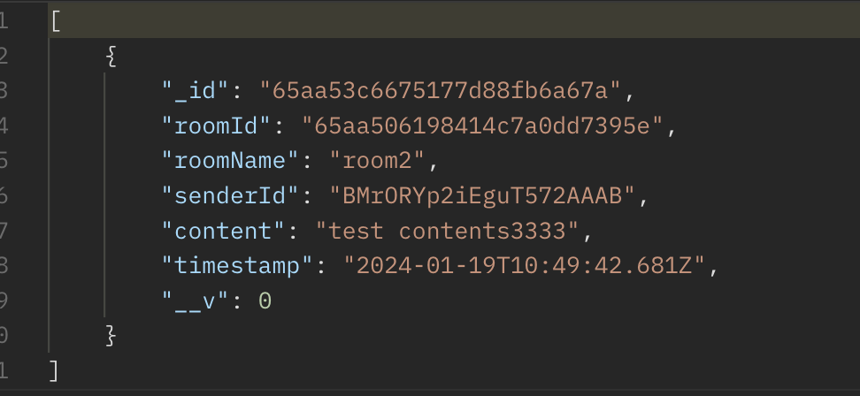
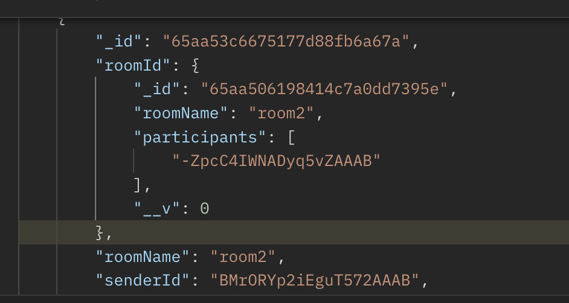

### 추가해야할 기능
- [x] 가입한 채팅방에 중복 참여 불가능
- [x] 채팅방 나가기 구현
- [x] 채팅 메세지를 채팅방의 ObjectId와 동적으로 연결하기
  - [x] 해결못해서 roomName에 unique를 주고 roomName으로 메세지 가져오기 구현

### 학습 필요
- objectId 이해 후 고유 식별자 사용에 대해 학습 후 리팩토링
- Redis Pub/Sub 구조에 대한 학습 후 적용하기 (현재 어댑터만 공식문서에서 따와서 적용해놓음)

### 보수해야할 점
- objectId가 아닌 string으로 대충 처리한 상태
- 몽고디비를 사용하는만큼 제대로 학습 후 populate를 사용해볼 것

### 학습정리
1. 왜 스키마에서 chatMessage를 chatRoom으로 연결해놓았음에도 오류가 발생하였는가?
  - 계속해서 타입 오류가 발생하였다.
  - 이는 스키마에서 오류가 발생한 줄 알았는데 아니었다. Mongoose를 통해 해당 채팅 메세지를 저장하는 부분을 수정함으로써 오류 해결 - chat-message.repository.ts

### 단순하게 채팅 메세지 불러오기

 

### Populate를 사용해서 채팅 메세지 불러오기
- 채팅방의 정보도 나오는 것을 확인 가능함
